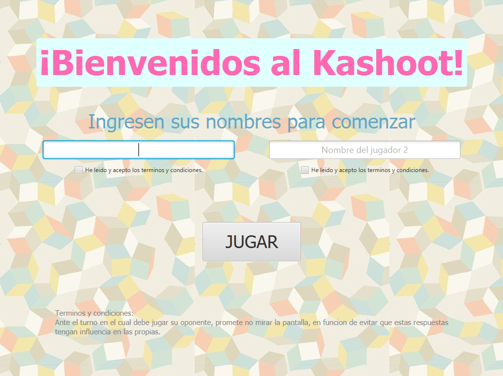
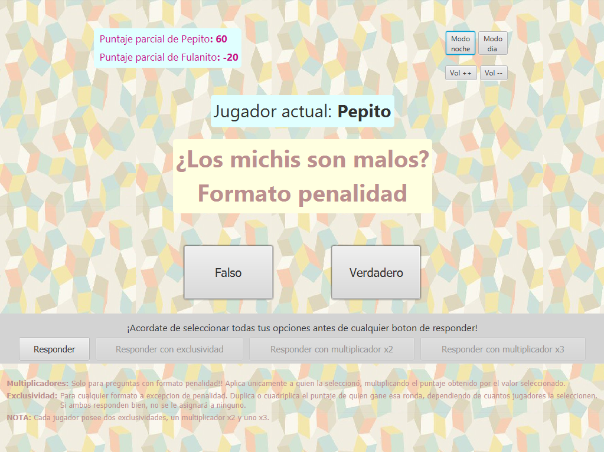
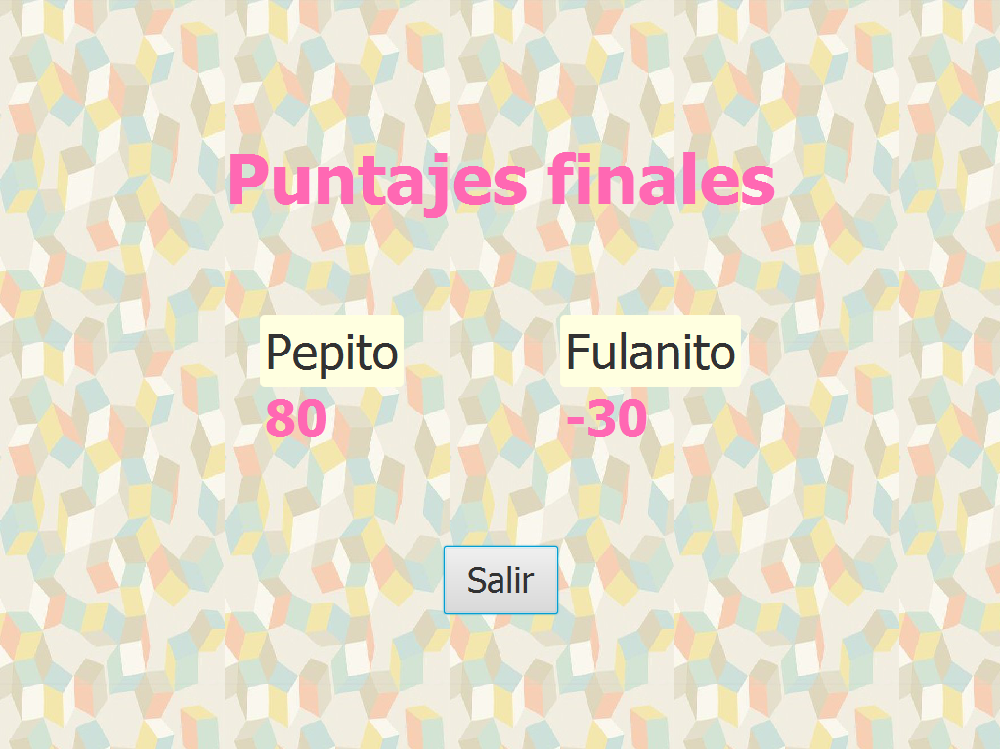

# Trabajo Practico 2 - KASHOOT

## Introducción

Se reune la documentación de la solución al segundo trabajo práctico de la materia Algoritmos y programación III. Consiste en desarrollar una aplicación utilizando el lenguaje de tipado estático Java, con un diseño orientado a objetos, y trabajando las técticas de TDD e integración continua.

## Contenido de la entrega

La entrega consta del desarrollo completo de la aplicación Kashoot, incluyendo:
  - Modelo de clases
  - Interfaz gráfica
  - Pruebas unitarias
  - Pruebas integrales
  - Documentación del diseño en su totalidad, incluyendo diagramas de clases, secuencias, estados y paquetes

## Especificaciones de la aplicación

Se desarrolló un juego por turnos de 2 jugadores, conformado por un panel en el cual se muestran preguntas con múltiples opciones de respuestas, en el cual cada pregunta se muestra 2 veces (una por cada jugador). Existen diferentes tipos de preguntas, las cuales asignan puntaje de forma diferenciada según el tipo de respuesta que escoja el jugador, y si selecciona o no responder con bonus. Quien mas puntaje acumule al finalizar el juego será el ganador.

